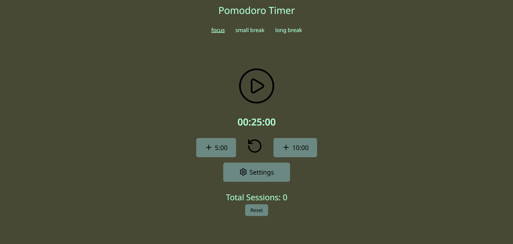

# 🍅 Pomodoro Timer App


> Uma aplicação interativa e simples de produtividade baseada na Técnica Pomodoro. Desenvolvida como resolução do desafio [roadmap.sh Pomodoro Timer project](https://roadmap.sh/projects/pomodoro-timer).

## 📖 Sobre o Projeto

Este projeto é um temporizador web customizável concebido para ajudar a gerir o tempo de forma eficiente utilizando a Técnica Pomodoro. Alterna entre sessões de trabalho focado e pausas curtas/longas, promovendo a produtividade e evitando o desgaste mental.

Esta aplicação demonstra a aplicação prática de gestão de estado, lógica de intervalos de tempo e design responsivo.

### ✨ Principais Funcionalidades

* **Intervalos Clássicos de Pomodoro:** Configuração padrão de 25 minutos de trabalho, 5 minutos de pausa curta e 15 minutos de pausa longa.
* **Temporizadores Personalizáveis:** Permite ajustar a duração dos intervalos de trabalho e pausa de acordo com o fluxo de trabalho do utilizador.
* **Notificações Sonoras:** Reprodução de um aviso sonoro no final de cada temporizador.
* **Gestão de Estado:** Opções para Iniciar, Pausar e Reiniciar o temporizador a qualquer momento.
* **Design Responsivo:** Interface otimizada para dispositivos móveis e computador.

## 🛠️ Tecnologias Utilizadas

* **Frontend:** [React / HTML5 / CSS3 / JavaScript]
* **Estilização:** [Tailwind CSS / Material UI / CSS Modulos]
* **Bibliotecas/Ferramentas:** 
  * [Lucide-React para ícones]
  * [React-Timer-Hook para manipulação do tempo]
  * [Vite]

## 🚀 Como Executar o Projeto

Para obter uma cópia local e executá-la, segue estes passos:

### Pré-requisitos

* Node.js instalado na máquina.
* Gestor de pacotes npm ou yarn.

### Instalação

1. Clona o repositório
   ```sh
   git clone https://github.com/talogo-dev/pomodoro-project.git
   ```

2. Entra na pasta do projeto
    ```sh
    cd pomodoro-project
    cd frontend
    ```

3. Instala as dependências
    ```sh
    npm install
    ```

4. Inicia a aplicação
    ```sh
    npm run dev
    ```

## 📸 Demonstração


## 🤝 Créditos
Ideia e requisitos do projeto fornecidos por [roadmap.sh](https://roadmap.sh/).

## 📝 Licença

Desenvolvido por Marco Cardoso.
